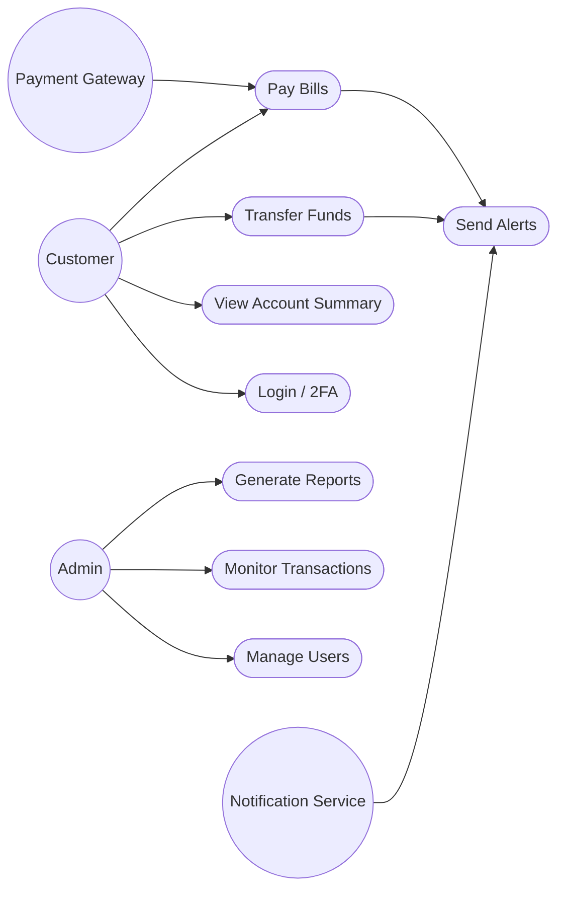
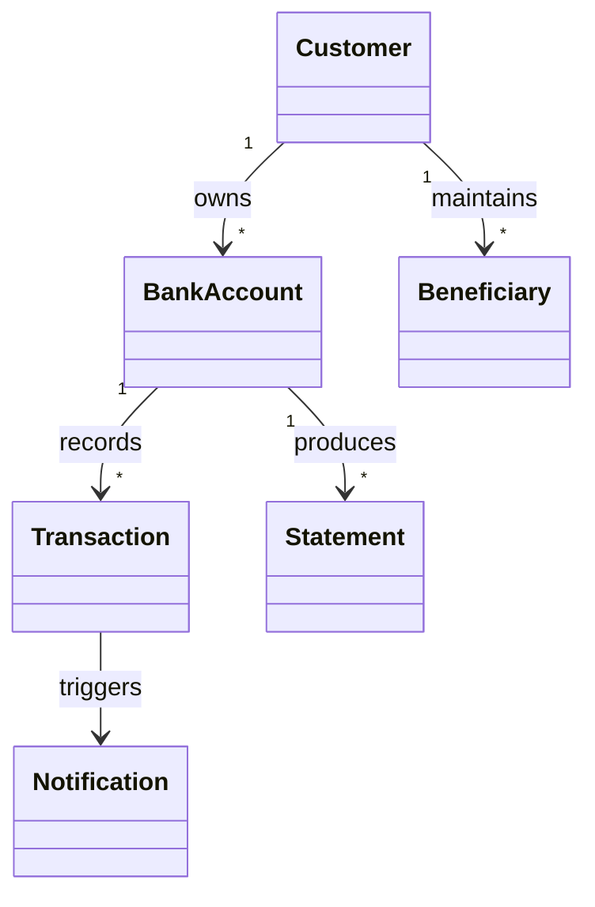
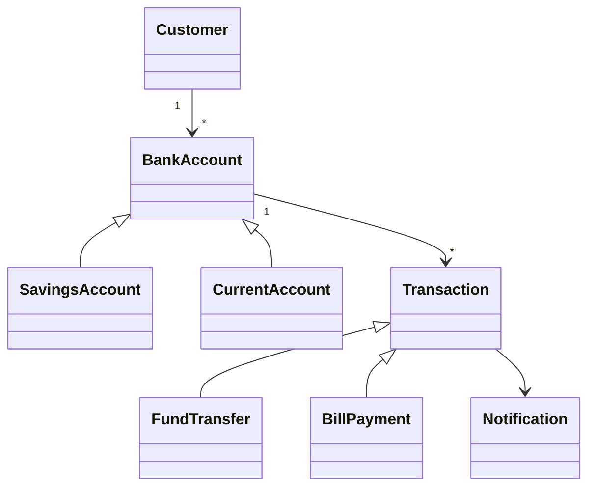
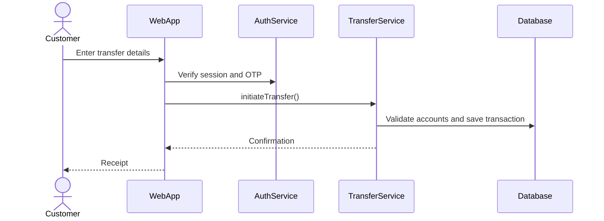
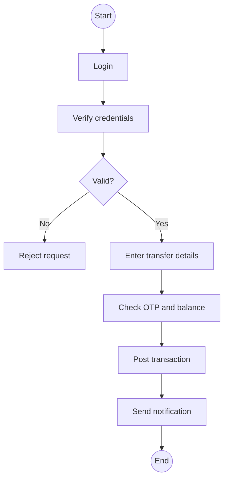
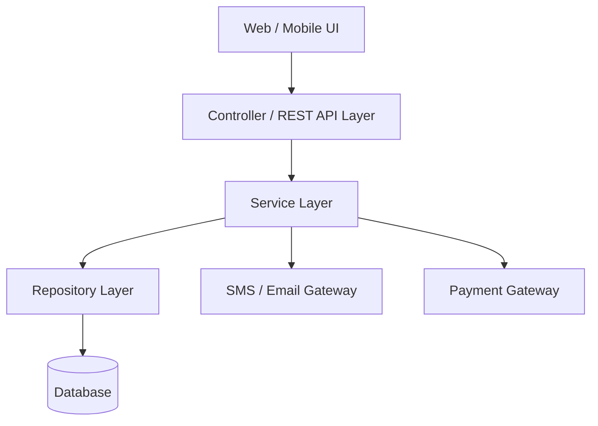
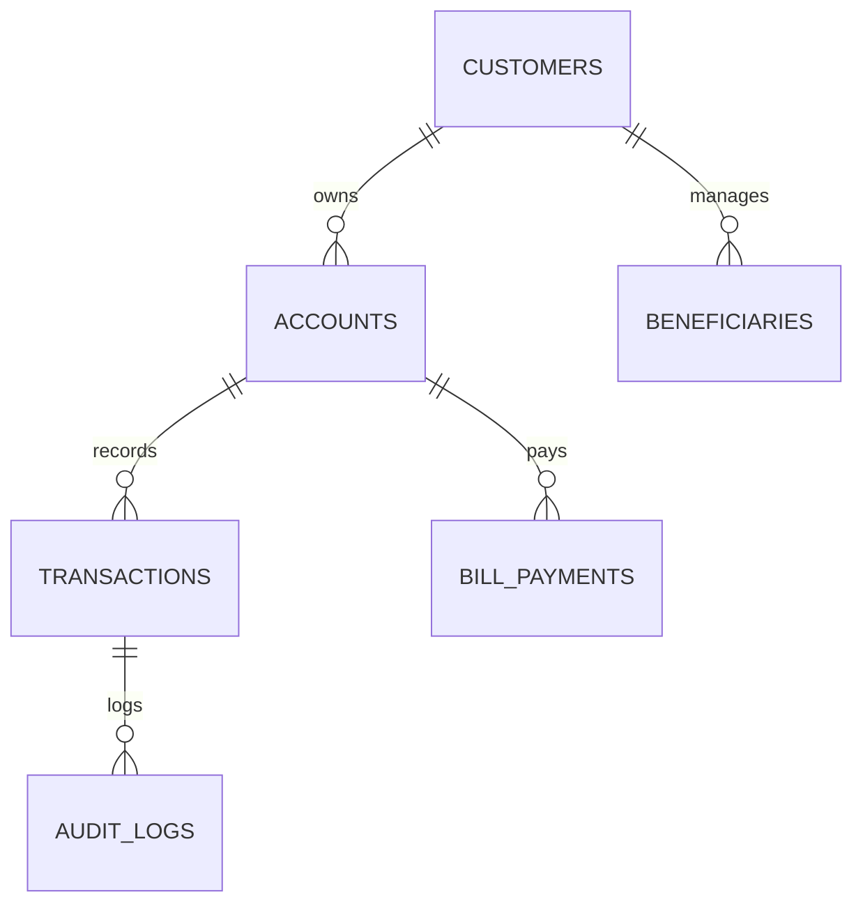

# Object-Oriented Software Engineering Case Study
## Online Banking System

**Prepared for:** Academic Project Submission
**Prepared by:** Pravin Gupta
**Date:** May 2026

## Table of Contents
- 1. Introduction
  - 1.1 Background of the Study
  - 1.2 Objectives of the Case Study
  - 1.3 Scope and Limitations
- 2. Overview of Object-Oriented Software Engineering (OOSE)
  - 2.1 Definition and Concepts
  - 2.2 Key Principles
  - 2.3 Advantages of OOSE
- 3. Case Description: Online Banking System
  - 3.1 Problem Statement
  - 3.2 System Requirements
  - 3.3 Stakeholders Identification
- 4. Object-Oriented Analysis (OOA)
  - 4.1 Identification of Classes and Objects
  - 4.2 Use Case Modeling
  - 4.3 Domain Modeling
- 5. Object-Oriented Design (OOD)
  - 5.1 Class Design and Relationships
  - 5.2 UML Diagrams
  - 5.3 Design Patterns Used
- 6. Implementation (Object-Oriented Programming)
  - 6.1 Programming Language and Tools
  - 6.2 System Architecture
  - 6.3 Database Design
- 7. Testing and Validation
  - 7.1 Unit Testing
  - 7.2 Integration Testing
  - 7.3 System Testing
- 8. Project Management Approach
  - 8.1 Development Methodology
  - 8.2 Iteration Planning
  - 8.3 Risk Management
- 9. Challenges and Issues
  - 9.1 Technical Challenges
  - 9.2 Design Challenges
  - 9.3 Operational Issues
- 10. Results and Outcomes
  - 10.1 System Performance
  - 10.2 User Satisfaction
  - 10.3 Efficiency Improvements
- 11. Lessons Learned and Best Practices
  - 11.1 Key Insights
  - 11.2 Recommended Practices
- 12. Conclusion and Future Work
- 13. References
- 14. Appendices
  - A: UML Diagrams
  - B: Sample Code
  - C: Test Cases

## Figures and Diagrams Included

1. Use Case Diagram
2. Domain Model Diagram
3. UML Class Diagram
4. UML Sequence Diagram
5. UML Activity Diagram
6. System Architecture Diagram
7. Database ER Diagram

## 1. Introduction

### 1.1 Background of the Study

Banking has moved from branch-centered service delivery to digital platforms where customers expect secure, fast, and always-available access to financial services. An online banking system allows users to view balances, transfer funds, pay bills, manage beneficiaries, download statements, and receive alerts without visiting a physical branch.

Because financial transactions involve sensitive personal data and direct monetary value, the system must be designed with strong security, accuracy, auditability, reliability, and usability. Object-Oriented Software Engineering (OOSE) is suitable for such a system because it models real banking entities such as Customer, Account, Transaction, Loan, Card, and Employee as interacting objects with clear responsibilities.

### 1.2 Objectives of the Case Study

The main objective of this case study is to apply OOSE concepts to the analysis, design, and implementation planning of an online banking system.

Specific objectives are to identify system requirements, model users and use cases, define domain classes, design class relationships, prepare UML diagrams, outline implementation architecture, describe testing strategies, and evaluate project management concerns.

### 1.3 Scope and Limitations

The scope includes customer registration, secure login, account overview, fund transfer, beneficiary management, bill payment, transaction history, statement generation, notifications, and administrative monitoring.

The study does not implement real interbank settlement, production-grade payment gateway integration, biometric identity verification, or legal compliance workflows in full detail. These are discussed as future enhancements because they depend on banking regulations, third-party providers, and institutional policies.

## 2. Overview of Object-Oriented Software Engineering (OOSE)

### 2.1 Definition and Concepts

Object-Oriented Software Engineering is a software development approach that uses object-oriented concepts throughout analysis, design, implementation, testing, and maintenance. Instead of viewing a system only as procedures, OOSE treats the system as a collection of objects that represent real-world or conceptual entities.

In an online banking system, Account objects store account data, Transaction objects represent financial activities, AuthenticationService objects verify identity, and Notification objects deliver alerts. Each object has attributes, behavior, and relationships with other objects.

### 2.2 Key Principles

Abstraction focuses on essential features while hiding unnecessary details. For example, a Customer uses transfer services without knowing the internal database update process.

Encapsulation keeps data and methods together and protects internal state. An Account balance should be changed only through controlled operations such as deposit, withdrawal, or transfer.

Inheritance allows a class to reuse and extend behavior from another class. SavingsAccount and CurrentAccount can inherit common properties from Account while adding specific rules.

Polymorphism lets different objects respond to the same operation in different ways. A Notification may be sent as SMS, email, or in-app alert using the same send() interface.

### 2.3 Advantages of OOSE

OOSE improves maintainability because banking features are divided into focused classes and services. It improves reusability because common behaviors such as authentication, validation, and notification can be reused across modules.

It also supports scalability because new account types, transaction categories, or payment channels can be added with limited changes. UML modeling improves communication among developers, testers, managers, and banking stakeholders.

## 3. Case Description: Online Banking System

### 3.1 Problem Statement

Traditional branch-based banking can be slow, location-dependent, and inconvenient for customers who need immediate service. Customers may need to wait for balance inquiries, fund transfers, statement requests, and bill payments.

The problem is to design an online banking system that provides secure digital access to banking services while preserving transaction accuracy, confidentiality, audit trails, and administrative control.

### 3.2 System Requirements

Functional requirements include user registration, login, two-factor authentication, account dashboard, balance inquiry, fund transfer, beneficiary addition, bill payment, transaction search, statement download, password reset, complaint submission, and admin monitoring.

Non-functional requirements include security, availability, usability, performance, maintainability, reliability, auditability, data integrity, and regulatory compliance. The system should respond quickly to normal user requests and should record every financial operation with timestamp, reference number, and status.

### 3.3 Stakeholders Identification

Primary stakeholders are customers, bank administrators, customer support officers, system administrators, auditors, and bank managers. Secondary stakeholders include payment gateway providers, regulatory bodies, SMS/email service providers, and core banking system operators.

Each stakeholder has different goals. Customers need convenience and trust. Administrators need control and monitoring. Auditors need accurate logs. Managers need reports. Regulators need policy compliance.

## 4. Object-Oriented Analysis (OOA)

### 4.1 Identification of Classes and Objects

Major classes include Customer, BankAccount, SavingsAccount, CurrentAccount, Transaction, FundTransfer, Beneficiary, BillPayment, AuthenticationService, Notification, Statement, AdminUser, AuditLog, and SupportTicket.

Objects are runtime instances of these classes. For example, customer Ram Sharma, savings account SB10045, transaction TXN20260512001, and beneficiary ElectricityOffice are objects with unique values and behavior.

### 4.2 Use Case Modeling

Important use cases include Register Customer, Login, View Account Summary, Transfer Funds, Add Beneficiary, Pay Bill, Download Statement, Receive Notification, Manage Users, Monitor Transactions, and Generate Reports.

The Customer actor performs most self-service operations. The Admin actor manages users and monitors system activity. The Payment Gateway actor confirms bill payment status. The Notification Service actor sends transaction alerts.



### 4.3 Domain Modeling

The domain model shows real-world banking concepts and their relationships. A Customer may own one or more BankAccounts. A BankAccount may have many Transactions. A FundTransfer is a specialized Transaction involving source and destination accounts. A Statement summarizes Transactions for a selected period.

Domain modeling helps ensure that software classes are aligned with banking reality and that important business rules are visible before coding begins.



## 5. Object-Oriented Design (OOD)

### 5.1 Class Design and Relationships

The design separates entities, services, repositories, and user interface controllers. Entity classes represent business data. Service classes handle business logic. Repository classes manage persistence. Controllers receive user requests and coordinate service calls.

Key relationships include association between Customer and BankAccount, composition between BankAccount and Transaction history, inheritance from BankAccount to SavingsAccount and CurrentAccount, and dependency from FundTransferService to AuthenticationService, AccountRepository, TransactionRepository, and NotificationService.

### 5.2 UML Diagrams

The project uses class, sequence, and activity diagrams. The class diagram describes static structure. The sequence diagram shows object interaction during fund transfer. The activity diagram shows the workflow from login to transaction confirmation.

Textual UML representations are included in Appendix A so they can be converted into graphical diagrams using PlantUML or any UML tool.







### 5.3 Design Patterns Used

Model-View-Controller separates user interface, business logic, and data. Repository pattern hides database operations behind clean interfaces. Factory pattern can create different account or notification types. Strategy pattern supports different authentication and payment verification methods.

Observer pattern is useful for notifications because successful transactions can automatically trigger SMS, email, and in-app alerts without tightly coupling transaction logic to every delivery channel.

## 6. Implementation (Object-Oriented Programming)

### 6.1 Programming Language and Tools

A suitable implementation stack is Java or C# for the backend, HTML/CSS/JavaScript or a framework such as React for the frontend, and MySQL or PostgreSQL for the database. Java with Spring Boot is a strong option because it supports object-oriented programming, security modules, REST APIs, dependency injection, validation, and testing.

Development tools may include IntelliJ IDEA or Eclipse, Git, Postman, MySQL Workbench, JUnit, and a UML modeling tool.

### 6.2 System Architecture

The proposed system uses a layered architecture: presentation layer, controller/API layer, service layer, data access layer, and database layer. External services such as payment gateway, SMS gateway, and email gateway communicate through controlled service interfaces.

This architecture improves separation of concerns. For example, changing the SMS provider should affect NotificationService implementation but not Account or Transaction classes.



### 6.3 Database Design

Core tables include customers, accounts, transactions, beneficiaries, bill_payments, statements, admin_users, audit_logs, notifications, and support_tickets. Primary keys identify records, while foreign keys preserve relationships such as customer-to-account and account-to-transaction.

Transaction records should be immutable after posting. Corrections should be handled through reversal or adjustment entries, not by deleting transaction history.



## 7. Testing and Validation

### 7.1 Unit Testing

Unit testing checks individual classes and methods. Examples include testing password validation, account balance calculation, transfer amount validation, transaction reference generation, and notification formatting.

Tests should cover normal cases, boundary cases, and invalid inputs such as negative transfer amount, insufficient balance, inactive beneficiary, and expired OTP.

### 7.2 Integration Testing

Integration testing verifies that modules work together. Examples include testing login with OTP service, fund transfer with account and transaction repositories, and bill payment with external gateway response.

Mock services can be used for SMS, email, and payment gateways so that tests remain reliable and repeatable.

### 7.3 System Testing

System testing validates the complete application from the user perspective. Testers check whether customers can register, log in, transfer funds, pay bills, download statements, and receive notifications.

Security testing is especially important. The system should be tested for weak passwords, session timeout, unauthorized access, SQL injection, cross-site scripting, brute-force login attempts, and broken access control.

## 8. Project Management Approach

### 8.1 Development Methodology

Agile methodology is recommended because online banking features can be delivered and reviewed in iterations. Each sprint can focus on a small group of features such as authentication, account dashboard, fund transfer, or bill payment.

For highly regulated banking environments, Agile can be combined with formal documentation and approval checkpoints to satisfy compliance requirements.

### 8.2 Iteration Planning

Iteration 1 covers requirement analysis, domain modeling, and login prototype. Iteration 2 covers account dashboard and transaction history. Iteration 3 covers beneficiary management and fund transfer. Iteration 4 covers bill payment, notification, and statement download. Iteration 5 covers admin dashboard, testing, security hardening, and deployment preparation.

Each iteration should end with a demo, feedback session, test review, and backlog update.

### 8.3 Risk Management

Major risks include security breaches, transaction inconsistency, payment gateway failure, poor performance during peak usage, unclear requirements, and regulatory non-compliance.

Mitigation strategies include encryption, multi-factor authentication, database transactions, audit logs, backups, load testing, secure coding review, stakeholder validation, and incident response planning.

## 9. Challenges and Issues

### 9.1 Technical Challenges

Technical challenges include secure authentication, concurrent transactions, database consistency, external service failure, network latency, and protection against cyberattacks.

Financial systems must be designed so that partial failures do not create incorrect balances. Atomic database transactions and clear transaction states such as pending, successful, failed, and reversed are necessary.

### 9.2 Design Challenges

Design challenges include avoiding overly complex class structures, keeping services loosely coupled, preventing duplication, and ensuring that security is integrated into the design rather than added at the end.

The system must also balance usability and security. For example, multi-factor authentication improves safety but should not make common workflows frustrating.

### 9.3 Operational Issues

Operational issues include server downtime, backup failure, delayed notifications, customer support load, forgotten passwords, suspicious activity monitoring, and user training.

A production online banking system needs monitoring dashboards, log analysis, disaster recovery plans, and support procedures for failed or disputed transactions.

## 10. Results and Outcomes

### 10.1 System Performance

The expected outcome is a system capable of handling common banking operations with fast response times under normal load. Frequently accessed data such as account summaries should be optimized, while transaction posting must prioritize correctness over raw speed.

Performance can be evaluated through response time, throughput, error rate, database query time, and concurrent user capacity.

### 10.2 User Satisfaction

User satisfaction improves when customers can complete banking tasks without branch visits, receive immediate confirmation, and access clear transaction history. A simple interface, understandable messages, and reliable notifications increase trust.

Feedback forms, support ticket analysis, and usability testing can be used to measure satisfaction.

### 10.3 Efficiency Improvements

The system reduces manual workload for bank staff by automating balance inquiry, statement generation, fund transfer initiation, and bill payment processing. It also reduces queues at physical branches.

Managers gain better visibility through reports and audit logs, while customers gain time savings and 24-hour access.

## 11. Lessons Learned and Best Practices

### 11.1 Key Insights

A banking system must be designed around trust. Security, accuracy, and auditability are not optional features; they are central system qualities.

OOSE helps developers understand the system by connecting software classes with real banking concepts. UML diagrams make requirements easier to discuss and validate before implementation.

### 11.2 Recommended Practices

Recommended practices include using strong authentication, validating all inputs, encrypting sensitive data, logging important events, using database transactions, writing automated tests, applying role-based access control, and performing regular security reviews.

The design should remain modular so new services such as mobile banking, QR payments, card management, and loan applications can be added later.

## 12. Conclusion and Future Work

This case study applied Object-Oriented Software Engineering to an online banking system. The study identified requirements, stakeholders, classes, use cases, domain relationships, design patterns, architecture, database structure, testing approach, project management plan, challenges, and expected outcomes.

Future work may include mobile application development, biometric login, AI-based fraud detection, real-time chat support, open banking APIs, QR payment integration, card control features, loan processing, and advanced analytics dashboards.

## 13. References

Booch, G., Rumbaugh, J., & Jacobson, I. The Unified Modeling Language User Guide. Addison-Wesley.

Sommerville, I. Software Engineering. Pearson Education.

Pressman, R. S., & Maxim, B. R. Software Engineering: A Practitioner's Approach. McGraw-Hill.

Gamma, E., Helm, R., Johnson, R., & Vlissides, J. Design Patterns: Elements of Reusable Object-Oriented Software. Addison-Wesley.

OWASP Foundation. OWASP Top Ten Web Application Security Risks.

## 14. Appendices
### Appendix A: UML Diagrams

### Class Diagram (Textual UML)

```
Customer "1" -- "many" BankAccount
BankAccount <|-- SavingsAccount
BankAccount <|-- CurrentAccount
BankAccount "1" -- "many" Transaction
Transaction <|-- FundTransfer
Transaction <|-- BillPayment
Customer "1" -- "many" Beneficiary
FundTransferService --> AuthenticationService
FundTransferService --> AccountRepository
FundTransferService --> TransactionRepository
FundTransferService --> NotificationService
AdminUser --> AuditLog
```

### Sequence Diagram: Fund Transfer

```
Customer -> WebApp: Enter transfer details
WebApp -> AuthenticationService: Verify session and OTP
AuthenticationService -> WebApp: Authentication success
WebApp -> FundTransferService: initiateTransfer()
FundTransferService -> AccountRepository: validate source and beneficiary
FundTransferService -> BankAccount: debit(amount)
FundTransferService -> BankAccount: credit(amount)
FundTransferService -> TransactionRepository: save(transaction)
FundTransferService -> NotificationService: send alerts
NotificationService -> Customer: SMS/Email/In-app confirmation
```

### Activity Diagram: Online Fund Transfer

```
Start
Login
Verify credentials
If invalid -> Show error -> End
Enter beneficiary and amount
Validate OTP
If OTP invalid -> Reject transfer -> End
Check balance
If insufficient -> Show failure -> End
Debit source account
Credit destination account
Record transaction
Send notification
Show receipt
End
```

### Appendix B: Sample Code

### Java Sample Class

```
public abstract class BankAccount {
    private String accountNumber;
    private double balance;

    public BankAccount(String accountNumber, double openingBalance) {
        this.accountNumber = accountNumber;
        this.balance = openingBalance;
    }

    public String getAccountNumber() {
        return accountNumber;
    }

    public double getBalance() {
        return balance;
    }

    public void deposit(double amount) {
        if (amount <= 0) {
            throw new IllegalArgumentException("Amount must be positive");
        }
        balance += amount;
    }

    public void withdraw(double amount) {
        if (amount <= 0 || amount > balance) {
            throw new IllegalArgumentException("Invalid withdrawal amount");
        }
        balance -= amount;
    }
}

public class SavingsAccount extends BankAccount {
    private double interestRate;

    public SavingsAccount(String accountNumber, double openingBalance, double interestRate) {
        super(accountNumber, openingBalance);
        this.interestRate = interestRate;
    }

    public double calculateMonthlyInterest() {
        return getBalance() * interestRate / 12;
    }
}
```

### Appendix C: Test Cases

### Appendix C: Test Cases

| ID | Test Scenario | Input | Expected Result | Status |
| --- | --- | --- | --- | --- |
| TC-01 | Login with valid credentials | Valid username, password, OTP | Dashboard opens | Pass |
| TC-02 | Login with wrong password | Invalid password | Access denied | Pass |
| TC-03 | Transfer with sufficient balance | Valid beneficiary and amount | Transfer successful | Pass |
| TC-04 | Transfer with insufficient balance | Amount greater than balance | Transfer rejected | Pass |
| TC-05 | Add beneficiary | Valid beneficiary account details | Beneficiary saved | Pass |
| TC-06 | Download statement | Valid date range | PDF statement generated | Pass |
| TC-07 | Expired OTP | OTP used after expiry | Transaction rejected | Pass |
| TC-08 | Admin views audit log | Admin role login | Audit records visible | Pass |